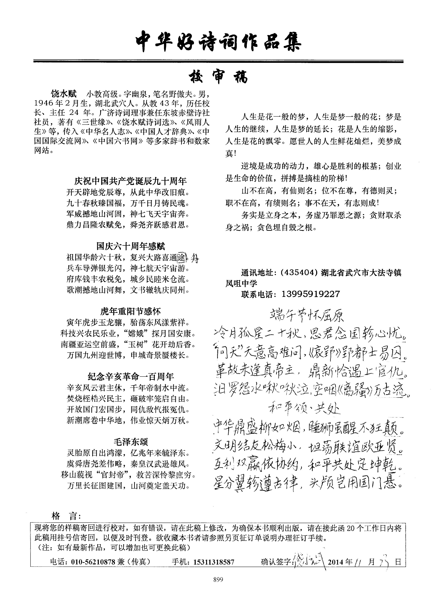

# 
饶水赋，字幽泉，笔名野傲夫，自号迷津居士。陋室九夷斋。1946年生， 湖北武穴人退休教师，小教高级职称。广济诗词理事兼任东坡赤壁诗社社员。 华夏文华促进会鸿雪诗社诗友。《中华正宗格律诗》编委。已被有关单位授予“当 代词坛诚昌杰”、“模范诗词艺术家”等多种荣誉称号。新世纪以来曾获“中 华骄子”拿十余种荣誉金奖，诗作在国内百余种书刊上发表。著有《饶水赋 诗词选》、《风雨人生》《九夷斋诗词文稿》等书。传略入编《中国当代创 业英才》等多家辞书和中国国际交流网等数字网站。
